<div align="center">
  <br />
  <p>
    <a href="https://github.com/alvar3zjos3/dev-readme-stats"></a>
  </p>
  <br />
  <h1>Dev Readme Stats</h1>
  <p>Genera tarjetas SVG dinámicas con métricas de commits, repositorios, lenguajes y WakaTime para tu README de GitHub.</p>
</div>

<p align="center">
  <a href="https://github.com/alvar3zjos3/dev-readme-stats/actions"></a>
  <a href="https://github.com/alvar3zjos3/dev-readme-stats/graphs/contributors"></a>
  <a href="https://codecov.io/gh/alvar3zjos3/dev-readme-stats"></a>
  <a href="https://github.com/alvar3zjos3/dev-readme-stats/issues"></a>
  <a href="https://github.com/alvar3zjos3/dev-readme-stats/pulls"></a>
  <a href="https://securityscorecards.dev/viewer/?uri=github.com/alvar3zjos3/dev-readme-stats"></a>
  
  
</p>

<p align="center">
  <a href="#-inicio-rápido">Inicio Rápido</a> ·
  <a href="#-tarjeta-de-estadísticas-de-github">Estadísticas</a> ·
  <a href="#-tarjeta-de-lenguajes-principales">Lenguajes</a> ·
  <a href="#-tarjeta-wakatime">WakaTime</a> ·
  <a href="#-pins-de-repositorios-y-gists">Pins</a> ·
  <a href="#-personalización-general">Personalización</a> ·
  <a href="#-todas-las-demos">Demos</a> ·
  <a href="#-desplegar-tu-propia-instancia">Despliegue</a> ·
  <a href="https://github.com/alvar3zjos3/dev-readme-stats/issues/new?assignees=&labels=bug&projects=&template=bug_report.yml">Reportar Bug</a> ·
  <a href="https://github.com/alvar3zjos3/dev-readme-stats/discussions/new?category=q-a">Hacer Pregunta</a>
</p>

<details>
<summary>📋 Tabla de contenidos (click para mostrar)</summary>

- [⚠️ Avisos Importantes](#️-avisos-importantes)
- [🧩 ¿Qué es Dev Readme Stats?](#-qué-es-dev-readme-stats)
  - [Características principales](#características-principales)
  - [Cómo funciona internamente](#cómo-funciona-internamente)
- [⚡ Inicio Rápido](#-inicio-rápido)
- [📊 Tarjeta de Estadísticas de GitHub](#-tarjeta-de-estadísticas-de-github)
    - [Ocultar estadísticas individuales](#ocultar-estadísticas-individuales)
    - [Mostrar estadísticas adicionales](#mostrar-estadísticas-adicionales)
    - [Mostrar iconos](#mostrar-iconos)
    - [Mostrar commits de un año específico](#mostrar-commits-de-un-año-específico)
    - [Sistema de rangos](#sistema-de-rangos)
    - [Opciones exclusivas de la tarjeta de estadísticas](#opciones-exclusivas-de-la-tarjeta-de-estadísticas)
    - [Demo tarjeta de estadísticas](#demo-tarjeta-de-estadísticas)
- [🗣️ Tarjeta de Lenguajes Principales](#️-tarjeta-de-lenguajes-principales)
    - [Algoritmo de estadísticas de lenguajes](#algoritmo-de-estadísticas-de-lenguajes)
    - [Diseños disponibles](#diseños-disponibles)
    - [Opciones exclusivas de lenguajes](#opciones-exclusivas-de-lenguajes)
    - [Demo tarjeta de lenguajes](#demo-tarjeta-de-lenguajes)
- [⏱️ Tarjeta WakaTime](#️-tarjeta-wakatime)
    - [Opciones exclusivas de WakaTime](#opciones-exclusivas-de-wakatime)
    - [Demo tarjeta WakaTime](#demo-tarjeta-wakatime)
- [📌 Pins de Repositorios y Gists](#-pins-de-repositorios-y-gists)
  - [Pin de Repositorio](#pin-de-repositorio)
  - [Pin de Gist](#pin-de-gist)
    - [Demo Pins](#demo-pins)
- [🎨 Personalización General](#-personalización-general)
    - [Opciones Comunes](#opciones-comunes)
    - [Temas integrados](#temas-integrados)
    - [Tema Responsivo](#tema-responsivo)
    - [Degradado en bg\_color](#degradado-en-bg_color)
    - [Idiomas disponibles](#idiomas-disponibles)
- [🖼️ Todas las Demos](#️-todas-las-demos)
  - [Alinear tarjetas lado a lado](#alinear-tarjetas-lado-a-lado)
    - [Estadísticas + Lenguajes](#estadísticas--lenguajes)
    - [Dos pins de repositorio](#dos-pins-de-repositorio)
    - [Stats + Lenguajes + WakaTime (3 columnas)](#stats--lenguajes--wakatime-3-columnas)
  - [Combinaciones de ejemplo](#combinaciones-de-ejemplo)
    - [Personalizar colores manualmente](#personalizar-colores-manualmente)
    - [Borde personalizado + esquinas redondeadas](#borde-personalizado--esquinas-redondeadas)
    - [Sin borde](#sin-borde)
    - [Pin de repositorio personalizado](#pin-de-repositorio-personalizado)
    - [Lenguajes — todas las combinaciones rápidas](#lenguajes--todas-las-combinaciones-rápidas)
- [🚀 Desplegar tu propia instancia](#-desplegar-tu-propia-instancia)
  - [GitHub Actions](#github-actions)
  - [Auto-alojado (Vercel/Otro)](#auto-alojado-vercelotro)
    - [Primer paso: obtener tu Token de Acceso Personal (PAT)](#primer-paso-obtener-tu-token-de-acceso-personal-pat)
    - [En Vercel](#en-vercel)
    - [En otras plataformas](#en-otras-plataformas)
    - [Variables de entorno disponibles](#variables-de-entorno-disponibles)
  - [Mantener tu fork actualizado](#mantener-tu-fork-actualizado)
- [📜 Licencia](#-licencia)
</details>

---

# ⚠️ Avisos Importantes

> [!IMPORTANT]
> La instancia pública `https://dev-readme-stats.vercel.app/api` funciona con el mejor esfuerzo posible y puede ser poco fiable por límites de velocidad y picos de tráfico. Para tarjetas fiables recomendamos [auto-alojamiento](#-desplegar-tu-propia-instancia) en Vercel u otro servidor, o usar el [flujo de GitHub Actions](#github-actions) para generar SVGs estáticos en tu [repositorio de perfil](https://docs.github.com/es/account-and-profile/how-tos/profile-customization/managing-your-profile-readme).


---

# 🧩 ¿Qué es Dev Readme Stats?

**Dev Readme Stats** es una herramienta de código abierto que genera tarjetas SVG dinámicas con tus métricas de GitHub para mostrarlas en el README de tu perfil. Funciona a través de una API desplegada en Vercel que consulta la API GraphQL de GitHub en tiempo real y devuelve una imagen SVG lista para incrustar.

## Características principales

- 🃏 **5 tipos de tarjetas** — estadísticas globales, lenguajes principales, WakaTime, pin de repositorio y pin de gist.
- 🎨 **Más de 260 temas integrados** — dark, radical, dracula, tokyonight, merko, synthwave, catppuccin, y muchos más.
- ✏️ **Totalmente personalizable** — colores hex, bordes, iconos, radio, idioma y degradados desde la URL.
- 🌗 **Tema responsivo** — soporte para modo oscuro/claro de GitHub con `prefers-color-scheme`.
- 🏅 **Sistema de rangos** — puntuación S → C calculada con un modelo estadístico ponderado sobre 6 métricas.
- 🌍 **Más de 40 idiomas** — con español (`es`) como idioma por defecto en este fork.
- 🚀 **Auto-alojable** — despliega en Vercel para evitar límites de velocidad públicos.
- ⚙️ **GitHub Actions** — genera SVGs estáticos periódicamente sin necesidad de servidor.
- 🔒 **Seguridad** — hardened runner, dependencias fijadas por hash SHA, OpenSSF Scorecard activo.

## Cómo funciona internamente

Cuando incrustas una URL de tarjeta en tu README, GitHub la solicita a través de su CDN. La API recibe la petición, consulta la API GraphQL de GitHub con tu token PAT, procesa los datos, construye el marcado SVG con el motor de renderizado interno (`render.js`) — escapando automáticamente todos los textos con `encodeHTML` para evitar inyecciones en el SVG — y devuelve la imagen con cabeceras de caché configuradas.

---

# ⚡ Inicio Rápido

La forma más rápida es pegar una URL en tu `README.md`. Sustituye `TU_USUARIO` por tu nombre de usuario de GitHub:

```md

```

Para poner varias tarjetas **en la misma línea**, usa HTML en lugar de Markdown:

```html
<a href="https://github.com/TU_USUARIO">
  
</a>
<a href="https://github.com/TU_USUARIO">
  
</a>
```

> [!TIP]
> Para un uso fiable a largo plazo, usa tu [propia instancia en Vercel](#en-vercel) o el [flujo de GitHub Actions](#github-actions). La instancia pública puede generar errores en horas de alto tráfico.

---

# 📊 Tarjeta de Estadísticas de GitHub

Muestra tus métricas principales: estrellas totales, commits, pull requests, issues, repositorios contribuidos y rango.

**Endpoint:** `api?username=TU_USUARIO`

```md
[Estadísticas GitHub](https://dev-readme-stats.vercel.app/api?username=alvar3zjos3)
```

**Resultado:**


> [!WARNING]
> Por defecto solo se muestran estadísticas de repositorios **públicos**. Para incluir datos privados debes [desplegar tu propia instancia](#-desplegar-tu-propia-instancia) con tu propio PAT.

### Ocultar estadísticas individuales

Usa `&hide=` con valores separados por comas para ocultar campos específicos de la tarjeta:

| Valor | Estadística que oculta |
|---|---|
| `stars` | Total de estrellas ganadas |
| `commits` | Total de commits |
| `prs` | Pull requests |
| `issues` | Issues |
| `contribs` | Repositorios contribuidos (el año pasado) |

```md
[Estadísticas GitHub](https://dev-readme-stats.vercel.app/api?username=alvar3zjos3&hide=stars,commits,prs,issues,contribs)
```


### Mostrar estadísticas adicionales

Usa `&show=` para mostrar métricas extra que no aparecen por defecto:

| Valor | Descripción |
|---|---|
| `reviews` | Revisiones de pull requests realizadas |
| `discussions_started` | Discusiones iniciadas |
| `discussions_answered` | Discusiones respondidas |
| `prs_merged` | Pull requests mergeados (total) |
| `prs_merged_percentage` | Porcentaje de PRs mergeados sobre el total |

```md
[Estadísticas GitHub](https://dev-readme-stats.vercel.app/api?username=alvar3zjos3&show=reviews,discussions_started,discussions_answered,prs_merged,prs_merged_percentage)
```


### Mostrar iconos

Los iconos están activados por defecto. Puedes forzar activarlos explícitamente con `&show_icons=true`:

```md
[Estadísticas GitHub](https://dev-readme-stats.vercel.app/api?username=alvar3zjos3&show_icons=true)
```

### Mostrar commits de un año específico

Filtra los commits a un año concreto con `&commits_year=AAAA`:

```md
[Estadísticas GitHub](https://dev-readme-stats.vercel.app/api?username=alvar3zjos3&commits_year=2025)
```


### Sistema de rangos

El rango se calcula como una **suma ponderada de percentiles** sobre seis métricas: commits, pull requests, revisiones, issues, estrellas y seguidores. Se basa en el [sistema académico japonés](https://wikipedia.org/wiki/Academic_grading_in_Japan):

| Rango | Percentil |
|---|---|
| **S** | Top 1% |
| **A+** | Top 12.5% |
| **A** | Top 25% |
| **A-** | Top 37.5% |
| **B+** | Top 50% |
| **B** | Top 62.5% |
| **B-** | Top 75% |
| **C+** | Top 87.5% |
| **C** | Todos los demás |

El círculo animado alrededor del rango muestra `100 - percentil_global`. Puedes cambiarlo con `&rank_icon=`:

<table>
<tr>
<td align="center"><b>rank_icon=default</b><br>
<a href="https://github.com/alvar3zjos3/dev-readme-stats"></a>
</td>
<td align="center"><b>rank_icon=github</b><br>
<a href="https://github.com/alvar3zjos3/dev-readme-stats"></a>
</td>
<td align="center"><b>rank_icon=percentile</b><br>
<a href="https://github.com/alvar3zjos3/dev-readme-stats"></a>
</td>
</tr>
</table>

### Opciones exclusivas de la tarjeta de estadísticas

| Nombre | Descripción | Tipo | Por defecto |
|---|---|---|---|
| `hide` | Oculta estadísticas individuales (ver [tabla arriba](#ocultar-estadísticas-individuales)). | string (comas) | `null` |
| `show` | Muestra estadísticas adicionales (ver [tabla arriba](#mostrar-estadísticas-adicionales)). | string (comas) | `null` |
| `hide_title` | Oculta el título de la tarjeta. | boolean | `false` |
| `hide_rank` | Oculta el rango y redimensiona la tarjeta automáticamente. | boolean | `false` |
| `rank_icon` | Icono del rango: `default`, `github` o `percentile`. | enum | `default` |
| `show_icons` | Muestra iconos junto a cada estadística. | boolean | `true` |
| `include_all_commits` | Cuenta el total histórico de commits en lugar de solo el año actual. | boolean | `true` |
| `commits_year` | Filtra y cuenta solo los commits del año indicado (`AAAA`). | integer | `<año actual>` |
| `card_width` | Ancho de la tarjeta en píxeles. | number | `500` |
| `line_height` | Alto de línea entre estadísticas. | integer | `25` |
| `exclude_repo` | Excluye repositorios del conteo de estrellas. | string (comas) | `null` |
| `custom_title` | Título personalizado para la tarjeta. | string | `<usuario> GitHub Stats` |
| `text_bold` | Usa texto en negrita. | boolean | `true` |
| `disable_animations` | Desactiva todas las animaciones SVG. | boolean | `false` |
| `ring_color` | Color del círculo animado del rango (hex sin `#`). | string (hex) | `2f80ed` |
| `number_format` | Formato numérico: `short` (ej. `6.6k`) o `long` (ej. `6626`). | enum | `short` |

### Demo tarjeta de estadísticas

<table>
<tr>
<td align="center">
<b>Por defecto</b><br>
<a href="https://github.com/alvar3zjos3/dev-readme-stats"></a>
</td>
<td align="center">
<b>Tema radical</b><br>
<a href="https://github.com/alvar3zjos3/dev-readme-stats"></a>
</td>
</tr>
<tr>
<td align="center">
<b>Tema tokyonight</b><br>
<a href="https://github.com/alvar3zjos3/dev-readme-stats"></a>
</td>
<td align="center">
<b>Tema dracula</b><br>
<a href="https://github.com/alvar3zjos3/dev-readme-stats"></a>
</td>
</tr>
<tr>
<td align="center">
<b>Con degradado</b><br>
<a href="https://github.com/alvar3zjos3/dev-readme-stats"></a>
</td>
<td align="center">
<b>Sin borde + rank oculto</b><br>
<a href="https://github.com/alvar3zjos3/dev-readme-stats"></a>
</td>
</tr>
</table>

---

# 🗣️ Tarjeta de Lenguajes Principales

Muestra los lenguajes de programación más presentes en tus repositorios públicos no bifurcados.

**Endpoint:** `api/top-langs?username=TU_USUARIO`

> [!NOTE]
> Los lenguajes principales **no indican nivel de habilidad**. Reflejan la cantidad de código de cada lenguaje en tus propios repositorios. No incluye contribuciones a repos ajenos. Solo analiza los primeros **100 repositorios** por limitaciones de la API de GitHub.

> [!WARNING]
> Solo muestra datos de repositorios **públicos**. Para incluir lenguajes de repos privados, necesitas [tu propia instancia](#-desplegar-tu-propia-instancia).

```md
[Lenguajes Principales](https://dev-readme-stats.vercel.app/api/top-langs?username=alvar3zjos3&theme=highcontrast)
```

**Resultado:**


### Algoritmo de estadísticas de lenguajes

El porcentaje de cada lenguaje se calcula con:

```
ranking_index = (byte_count ^ size_weight) * (repo_count ^ count_weight)
```

| Configuración | Comportamiento |
|---|---|
| `&size_weight=1&count_weight=0` | *(por defecto)* Ordena puramente por bytes de código |
| `&size_weight=0.5&count_weight=0.5` | *(recomendado)* Combina bytes y número de repos |
| `&size_weight=0&count_weight=1` | Ordena por número de repositorios en que aparece |

```md
<!-- Algoritmo combinado (recomendado) -->
[Lenguajes Principales](https://dev-readme-stats.vercel.app/api/top-langs/?username=alvar3zjos3&size_weight=0.5&count_weight=0.5)
```

### Diseños disponibles

Cambia el diseño con `&layout=NOMBRE`:

<table>
<tr>
<td align="center">
<b>compact (por defecto)</b><br>
<a href="https://github.com/alvar3zjos3/dev-readme-stats"></a><br>
<code>&layout=compact</code>
</td>
<td align="center">
<b>normal</b><br>
<a href="https://github.com/alvar3zjos3/dev-readme-stats"></a><br>
<code>&layout=normal</code>
</td>
</tr>
<tr>
<td align="center">
<b>donut</b><br>
<a href="https://github.com/alvar3zjos3/dev-readme-stats"></a><br>
<code>&layout=donut</code>
</td>
<td align="center">
<b>donut-vertical</b><br>
<a href="https://github.com/alvar3zjos3/dev-readme-stats"></a><br>
<code>&layout=donut-vertical</code>
</td>
</tr>
<tr>
<td align="center">
<b>pie</b><br>
<a href="https://github.com/alvar3zjos3/dev-readme-stats"></a><br>
<code>&layout=pie</code>
</td>
<td align="center">
<b>hide_progress=true</b><br>
<a href="https://github.com/alvar3zjos3/dev-readme-stats"></a><br>
<code>&hide_progress=true</code>
</td>
</tr>
</table>

### Opciones exclusivas de lenguajes

| Nombre | Descripción | Tipo | Por defecto |
|---|---|---|---|
| `hide` | Oculta lenguajes específicos. | string (comas) | `null` |
| `hide_title` | Oculta el título de la tarjeta. | boolean | `false` |
| `hide_progress` | Oculta barras de progreso y porcentajes. | boolean | `false` |
| `layout` | Diseño: `normal`, `compact`, `donut`, `donut-vertical` o `pie`. | enum | `normal` |
| `card_width` | Ancho de la tarjeta en píxeles. | number | `300` |
| `langs_count` | Número de lenguajes a mostrar (1–20). | integer | `5` (normal/donut), `6` (otros) |
| `exclude_repo` | Excluye repositorios del análisis. | string (comas) | `null` |
| `custom_title` | Título personalizado para la tarjeta. | string | `Most Used Languages` |
| `disable_animations` | Desactiva animaciones SVG. | boolean | `false` |
| `size_weight` | Peso del recuento de bytes en el algoritmo. | number | `1` |
| `count_weight` | Peso del número de repos en el algoritmo. | number | `0` |
| `stats_format` | Formato: `percentages` (porcentaje) o `bytes` (bytes). | enum | `percentages` |

### Demo tarjeta de lenguajes

```md
<!-- Excluir repositorios -->
[Lenguajes](https://dev-readme-stats.vercel.app/api/top-langs/?username=alvar3zjos3&exclude_repo=dev-readme-stats,alvar3zjos3.github.io)

<!-- Ocultar lenguajes específicos -->
[Lenguajes](https://dev-readme-stats.vercel.app/api/top-langs/?username=alvar3zjos3&hide=javascript,html)

<!-- Mostrar más lenguajes (hasta 20) -->
[Lenguajes](https://dev-readme-stats.vercel.app/api/top-langs/?username=alvar3zjos3&langs_count=20)

<!-- Mostrar bytes en lugar de porcentaje -->
[Lenguajes](https://dev-readme-stats.vercel.app/api/top-langs/?username=alvar3zjos3&stats_format=bytes)
```

<table>
<tr>
<td align="center"><b>stats_format=bytes</b><br><a href="https://github.com/alvar3zjos3/dev-readme-stats"></a></td>
<td align="center"><b>langs_count=10</b><br><a href="https://github.com/alvar3zjos3/dev-readme-stats"></a></td>
</tr>
</table>

---

# ⏱️ Tarjeta WakaTime

Muestra el tiempo de codificación y desglose de lenguajes registrado en tu cuenta de [WakaTime](https://wakatime.com).

**Endpoint:** `api/wakatime?username=TU_USUARIO_WAKATIME`

> [!WARNING]
> Solo funciona con perfiles de WakaTime **públicos**. Asegúrate de que **ambas** opciones estén activadas en tu cuenta: `Display code time publicly` y `Display languages, editors, os, categories publicly`.

> [!WARNING]
> Si acabas de crear tu cuenta de WakaTime, pueden pasar hasta **24 horas** hasta que los datos aparezcan en la tarjeta.

```md
[WakaTime Stats](https://dev-readme-stats.vercel.app/api/wakatime?username=alvar3zjos3&theme=cobalt)
```

**Resultado:**


### Opciones exclusivas de WakaTime

| Nombre | Descripción | Tipo | Por defecto |
|---|---|---|---|
| `hide` | Oculta lenguajes específicos. | string (comas) | `null` |
| `hide_title` | Oculta el título de la tarjeta. | boolean | `false` |
| `hide_progress` | Oculta barras de progreso y porcentajes. | boolean | `false` |
| `card_width` | Ancho de la tarjeta en píxeles. | number | `495` |
| `line_height` | Alto de línea entre elementos. | integer | `25` |
| `custom_title` | Título personalizado. | string | `WakaTime Stats` |
| `layout` | Diseño: `default` o `compact`. | enum | `default` |
| `langs_count` | Limita el número de lenguajes mostrados. | integer | `null` |
| `api_domain` | Dominio de API personalizado (para instancias self-hosted de WakaTime). | string | `wakatime.com` |
| `display_format` | Formato: `time` (tiempo real) o `percent` (porcentaje). | enum | `time` |
| `disable_animations` | Desactiva animaciones SVG. | boolean | `false` |

### Demo tarjeta WakaTime

<table>
<tr>
<td align="center">
<b>Layout default</b><br>
<a href="https://github.com/alvar3zjos3/dev-readme-stats"></a>
</td>
<td align="center">
<b>Layout compact</b><br>
<a href="https://github.com/alvar3zjos3/dev-readme-stats"></a>
</td>
</tr>
<tr>
<td align="center">
<b>hide_progress=true</b><br>
<a href="https://github.com/alvar3zjos3/dev-readme-stats"></a>
</td>
<td align="center">
<b>display_format=percent</b><br>
<a href="https://github.com/alvar3zjos3/dev-readme-stats"></a>
</td>
</tr>
</table>

---

# 📌 Pins de Repositorios y Gists

## Pin de Repositorio

Permite pinear más de 6 repositorios en tu perfil superando el límite nativo de GitHub.

**Endpoint:** `api/pin/?username=TU_USUARIO&repo=NOMBRE_REPO`

```md
[Pin Repositorio](https://dev-readme-stats.vercel.app/api/pin/?username=alvar3zjos3&repo=dev-readme-stats&theme=radical)
```

**Resultado:**

<a href="https://github.com/alvar3zjos3/dev-readme-stats"></a>

**Opciones exclusivas del pin de repositorio:**

| Nombre | Descripción | Tipo | Por defecto |
|---|---|---|---|
| `username` | *(requerido)* Nombre de usuario de GitHub. | string | — |
| `repo` | *(requerido)* Nombre del repositorio. | string | — |
| `show_owner` | Muestra el nombre del propietario en la tarjeta. | boolean | `false` |
| `description_lines_count` | Número de líneas de descripción (1–3). | number | `null` (auto) |

Con `show_owner=true`:

```md
[Pin Repositorio](https://dev-readme-stats.vercel.app/api/pin/?username=alvar3zjos3&repo=dev-readme-stats&show_owner=true&theme=radical)
```

<a href="https://github.com/alvar3zjos3/dev-readme-stats"></a>

## Pin de Gist

Permite pinear gists de GitHub directamente en tu perfil.

**Endpoint:** `api/gist?id=ID_DEL_GIST`

> [!TIP]
> El ID del gist está en su URL: `https://gist.github.com/usuario/ID_DEL_GIST`

```md
[Pin Gist](https://dev-readme-stats.vercel.app/api/gist?id=bbfce31e0217a3689c8d961a356cb10d&theme=synthwave)
```

**Resultado:**

<a href="https://github.com/alvar3zjos3/dev-readme-stats"></a>

**Opciones exclusivas del pin de gist:**

| Nombre | Descripción | Tipo | Por defecto |
|---|---|---|---|
| `id` | *(requerido)* ID del gist de GitHub. | string | — |
| `show_owner` | Muestra el nombre del propietario del gist. | boolean | `false` |

Con `show_owner=true`:

<a href="https://github.com/alvar3zjos3/dev-readme-stats"></a>

### Demo Pins

<a href="https://github.com/alvar3zjos3/dev-readme-stats"></a> <a href="https://github.com/alvar3zjos3/dev-readme-stats"></a>

---

# 🎨 Personalización General

Todos los parámetros se pasan como query strings en la URL. Se pueden combinar libremente.

### Opciones Comunes

Estas opciones aplican a **todas** las tarjetas:

| Nombre | Descripción | Tipo | Por defecto |
|---|---|---|---|
| `title_color` | Color del título (hex sin `#`). | string (hex) | `fff` |
| `text_color` | Color del texto del cuerpo (hex sin `#`). | string (hex) | `9f9f9f` |
| `icon_color` | Color de los iconos (hex sin `#`). | string (hex) | `79ff97` |
| `border_color` | Color del borde (ignorado si `hide_border=true`). | string (hex) | `e4e2e2` |
| `bg_color` | Color de fondo o degradado (ver [sección abajo](#degradado-en-bg_color)). | string | `151515` |
| `hide_border` | Oculta el borde de la tarjeta. | boolean | `false` |
| `theme` | Nombre del tema a aplicar. | enum | `default` |
| `cache_seconds` | Duración del caché en segundos (mín: 21600 = 6h · máx: 86400 = 24h). | integer | `21600` |
| `locale` | Idioma de la tarjeta (ver [idiomas disponibles](#idiomas-disponibles)). | enum | `es` |
| `border_radius` | Radio de las esquinas de la tarjeta. | number | `4.5` |

> [!WARNING]
> Tiempos de caché por defecto: estadísticas — 24h · lenguajes — 144h (6 días) · pin — 240h (10 días) · gist — 48h · WakaTime — 24h. Para actualizaciones más frecuentes, despliega tu propia instancia y configura `CACHE_SECONDS`.

### Temas integrados

> [!NOTE]
> **Convención de temas especiales:**
> - `default` → tema **oscuro** por defecto de este fork.
> - `white` → variante **clara** (fondo blanco).
> - `default_repocard` → variante por defecto específica para la **tarjeta pin**, no aparece en otras tarjetas.
> - `transparent` → fondo completamente transparente, se adapta a cualquier tema de GitHub.

Este fork incluye **más de 260 temas**, organizados en las siguientes categorías:

| Categoría | Ejemplos |
|---|---|
| **Clásicos** | `default`, `white`, `dark`, `radical`, `merko`, `gruvbox`, `tokyonight` |
| **Editores** | `dracula`, `onedark`, `synthwave`, `cobalt`, `monokai`, `nightowl` |
| **Comunidad** | `catppuccin_mocha`, `catppuccin_latte`, `rose_pine`, `github_dark`, `nord` |
| **Generativos** (nuevos) | `cosmic_*`, `stellar_*`, `lunar_*`, `ocean_*`, `twilight_*`, `dawn_*`, `dusk_*` |

Algunos de los temas más populares:

<table>
<tr>
<td align="center"><b>default</b><br><a href="https://github.com/alvar3zjos3/dev-readme-stats"></a></td>
<td align="center"><b>white</b><br><a href="https://github.com/alvar3zjos3/dev-readme-stats"></a></td>
<td align="center"><b>dark</b><br><a href="https://github.com/alvar3zjos3/dev-readme-stats"></a></td>
</tr>
<tr>
<td align="center"><b>radical</b><br><a href="https://github.com/alvar3zjos3/dev-readme-stats"></a></td>
<td align="center"><b>merko</b><br><a href="https://github.com/alvar3zjos3/dev-readme-stats"></a></td>
<td align="center"><b>gruvbox</b><br><a href="https://github.com/alvar3zjos3/dev-readme-stats"></a></td>
</tr>
<tr>
<td align="center"><b>tokyonight</b><br><a href="https://github.com/alvar3zjos3/dev-readme-stats"></a></td>
<td align="center"><b>onedark</b><br><a href="https://github.com/alvar3zjos3/dev-readme-stats"></a></td>
<td align="center"><b>cobalt</b><br><a href="https://github.com/alvar3zjos3/dev-readme-stats"></a></td>
</tr>
<tr>
<td align="center"><b>synthwave</b><br><a href="https://github.com/alvar3zjos3/dev-readme-stats"></a></td>
<td align="center"><b>highcontrast</b><br><a href="https://github.com/alvar3zjos3/dev-readme-stats"></a></td>
<td align="center"><b>dracula</b><br><a href="https://github.com/alvar3zjos3/dev-readme-stats"></a></td>
</tr>
</table>

Consulta la [lista completa de temas](themes/README.md) y el [archivo de configuración](themes/index.js).

### Tema Responsivo

Como GitHub sirve las imágenes desde su CDN, no puede detectar el modo oscuro/claro del navegador en el servidor. Hay cuatro formas de implementarlo:

#### 1. Tema `transparent`

El fondo desaparece y hereda el color del README, funcionando en ambos modos:

```md
[Estadísticas GitHub](https://dev-readme-stats.vercel.app/api?username=alvar3zjos3&theme=transparent)
```

<details>
<summary>👁️ Ver ejemplo</summary>


</details>

#### 2. Canal alfa transparente en `bg_color`

```md
[Estadísticas GitHub](https://dev-readme-stats.vercel.app/api?username=alvar3zjos3&bg_color=00000000)
```

<details>
<summary>👁️ Ver ejemplo</summary>


</details>

#### 3. Etiquetas de contexto de tema de GitHub

GitHub muestra u oculta imágenes según el modo activo del usuario con los sufijos `#gh-dark-mode-only` y `#gh-light-mode-only`:

```md
[Estadísticas - Oscuro](https://dev-readme-stats.vercel.app/api?username=alvar3zjos3&theme=default#gh-dark-mode-only)
[Estadísticas - Claro](https://dev-readme-stats.vercel.app/api?username=alvar3zjos3&theme=white#gh-light-mode-only)
```

<details>
<summary>👁️ Ver ejemplo</summary>


</details>

#### 4. Elemento `<picture>` con `prefers-color-scheme` *(recomendado)*

La forma más estándar y compatible con todos los navegadores:

```html
<picture>
  <source
    srcset="https://dev-readme-stats.vercel.app/api?username=alvar3zjos3&hide=issues&theme=default"
    media="(prefers-color-scheme: dark)"
  />
  <source
    srcset="https://dev-readme-stats.vercel.app/api?username=alvar3zjos3&hide=issues&theme=white"
    media="(prefers-color-scheme: light), (prefers-color-scheme: no-preference)"
  />
  
</picture>
```

<details>
<summary>👁️ Ver ejemplo</summary>

<picture>
  <source srcset="https://dev-readme-stats.vercel.app/api?username=alvar3zjos3&hide=issues&theme=default" media="(prefers-color-scheme: dark)" />
  <source srcset="https://dev-readme-stats.vercel.app/api?username=alvar3zjos3&hide=issues&theme=white" media="(prefers-color-scheme: light), (prefers-color-scheme: no-preference)" />
  
</picture>

</details>

### Degradado en bg\_color

Pasa múltiples colores separados por comas para un fondo degradado. El primer valor es el ángulo (0–360):

```
&bg_color=ÁNGULO,COLOR1,COLOR2,...COLOR10
```

```md
<!-- Degradado de naranja a morado -->


<!-- Degradado de azul a verde -->


<!-- Degradado arcoíris -->

```

<table>
<tr>
<td align="center">
<a href="https://github.com/alvar3zjos3/dev-readme-stats"></a>
</td>
<td align="center">
<a href="https://github.com/alvar3zjos3/dev-readme-stats"></a>
</td>
<td align="center">
<a href="https://github.com/alvar3zjos3/dev-readme-stats"></a>
</td>
</tr>
</table>

### Idiomas disponibles

Usa `&locale=CÓDIGO` para cambiar el idioma de los textos de la tarjeta:

<table>
<tr><td>

| Código | Idioma |
| --- | --- |
| `ar` | Árabe |
| `az` | Azerbaiyano |
| `bn` | Bengalí |
| `bg` | Búlgaro |
| `my` | Birmano |
| `ca` | Catalán |
| `cn` | Chino |
| `zh-tw` | Chino (Taiwán) |
| `cs` | Checo |
| `nl` | Holandés |
| `en` | Inglés |
| `fil` | Filipino |
| `fi` | Finlandés |
| `fr` | Francés |
| `de` | Alemán |
| `el` | Griego |

</td><td>

| Código | Idioma |
| --- | --- |
| `he` | Hebreo |
| `hi` | Hindi |
| `hu` | Húngaro |
| `id` | Indonesio |
| `it` | Italiano |
| `ja` | Japonés |
| `kr` | Coreano |
| `ml` | Malayalam |
| `np` | Nepalés |
| `no` | Noruego |
| `fa` | Persa (Farsi) |
| `pl` | Polaco |
| `pt-br` | Portugués (Brasil) |
| `pt-pt` | Portugués (Portugal) |
| `ro` | Rumano |

</td><td>

| Código | Idioma |
| --- | --- |
| `ru` | Ruso |
| `sa` | Sánscrito |
| `sr` | Serbio (Cirílico) |
| `sr-latn` | Serbio (Latino) |
| `sk` | Eslovaco |
| `es` | Español |
| `sw` | Suajili |
| `se` | Sueco |
| `ta` | Tamil |
| `th` | Tailandés |
| `tr` | Turco |
| `uk-ua` | Ucraniano |
| `ur` | Urdu |
| `uz` | Uzbeko |
| `vi` | Vietnamita |

</td></tr>
</table>

---

# 🖼️ Todas las Demos

## Alinear tarjetas lado a lado

Por defecto GitHub pone las imágenes una debajo de otra. Usa etiquetas `` con `height` y `align="center"` para ponerlas en la misma línea:

### Estadísticas + Lenguajes

```html
<a href="https://github.com/alvar3zjos3/dev-readme-stats">
  
</a>
<a href="https://github.com/alvar3zjos3/dev-readme-stats">
  
</a>
```

**Resultado:**

<a href="https://github.com/alvar3zjos3/dev-readme-stats"></a>
<a href="https://github.com/alvar3zjos3/dev-readme-stats"></a>

### Dos pins de repositorio

```html
<a href="https://github.com/alvar3zjos3/dev-readme-stats">
  
</a>
<a href="https://github.com/alvar3zjos3/dev-readme-stats">
  
</a>
```

**Resultado:**

<a href="https://github.com/alvar3zjos3/dev-readme-stats"></a>
<a href="https://github.com/alvar3zjos3/dev-readme-stats"></a>

### Stats + Lenguajes + WakaTime (3 columnas)

```html
<a href="https://github.com/alvar3zjos3/dev-readme-stats">
  </a>
<a href="https://github.com/alvar3zjos3/dev-readme-stats">
  </a>
<a href="https://github.com/alvar3zjos3/dev-readme-stats">
  </a>
```

**Resultado:**

<a href="https://github.com/alvar3zjos3/dev-readme-stats">
  </a>
<a href="https://github.com/alvar3zjos3/dev-readme-stats">
  </a>
<a href="https://github.com/alvar3zjos3/dev-readme-stats">
  </a>

## Combinaciones de ejemplo

### Personalizar colores manualmente

```md
[Estadísticas Personalizada](https://dev-readme-stats.vercel.app/api?username=alvar3zjos3&hide=issues&title_color=f05e&icon_color=ff0000&text_color=12fe59&bg_color=42aef1)
```


### Borde personalizado + esquinas redondeadas

```md
[Estadísticas](https://dev-readme-stats.vercel.app/api?username=alvar3zjos3&hide=issues&border_color=79ff97&border_radius=15&theme=tokyonight)
```


### Sin borde

```md
[Estadísticas](https://dev-readme-stats.vercel.app/api?username=alvar3zjos3&hide=issues&hide_border=true&theme=radical)
```


### Pin de repositorio personalizado

```md
[Pin](https://dev-readme-stats.vercel.app/api/pin?username=alvar3zjos3&repo=dev-readme-stats&title_color=f05e&icon_color=ff0000&text_color=12fe59&bg_color=42aef1)
```


### Lenguajes — todas las combinaciones rápidas

<table>
<tr>
<td>

```md
<!-- Normal + bytes -->

```

</td>
<td>

```md
<!-- Compact + 10 lenguajes -->

```

</td>
</tr>
<tr>
<td>

```md
<!-- Donut + tema synthwave -->

```

</td>
<td>

```md
<!-- Pie + tema merko -->

```

</td>
</tr>
</table>

---

# 🚀 Desplegar tu propia instancia

Dado que el endpoint público [no es fiable](#-avisos-importantes), recomendamos el auto-despliegue:

| Método | Ventajas | Desventajas |
|---|---|---|
| **GitHub Actions** | Sin servidor, gratis, SVGs estáticos en el repo | Se actualiza en el horario programado, no en tiempo real |
| **Vercel / Auto-alojado** | Datos en tiempo real, control total del caché y tokens | Requiere configuración inicial |

## GitHub Actions

Genera SVGs estáticos periódicamente y los guarda en tu repositorio. No requiere llamadas a la API en cada visita al perfil.

> [!NOTE]
> La acción usa `GITHUB_TOKEN` por defecto (solo estadísticas públicas). Para estadísticas privadas, crea un [PAT](#primer-paso-obtener-tu-token-de-acceso-personal-pat) y pásalo como secreto del repositorio.

> [!NOTE]
> El flujo `generate-theme-doc.yml` crea automáticamente la rama `updated-theme-readme` y abre un **Pull Request** contra `master` en lugar de hacer push directo. No se crean PRs duplicados si ya existe uno abierto.

> [!IMPORTANT]
> Para que el job `create_pr` pueda abrir Pull Requests, debes ir a **Settings → Actions → General → Workflow permissions** de tu repositorio y activar **"Allow GitHub Actions to create and approve pull requests"**.

Crea `/.github/workflows/update-stats.yml` en tu repositorio de perfil (`TU_USUARIO/TU_USUARIO`):

```yaml
name: Generar todas las tarjetas y temas

on:
  schedule:
    - cron: "0 3 * * *"
  workflow_dispatch:

permissions:
  contents: read

jobs:
  generate_svgs_1:
    runs-on: ubuntu-latest
    permissions:
      contents: write
      pull-requests: write
    strategy:
      fail-fast: false
      max-parallel: 15
      matrix:
        theme:
          [
            "default",
            "white",
            "default_repocard",
            "transparent",
            "shadow_red",
            "shadow_green",
            "shadow_blue",
            "dark",
            "radical",
            "merko",
            "gruvbox",
            "gruvbox_light",
            "tokyonight",
            "onedark",
            "cobalt",
            "synthwave",
            "highcontrast",
            "dracula",
            "prussian",
            "monokai",
            "vue",
            "nightowl",
            "buefy",
            "algolia",
            "darcula",
            "bear",
            "nord",
            "gotham",
            "graywhite",
            "calm",
            "omni",
            "react",
            "jolly",
            "maroongold",
            "yeblu",
            "blueberry",
            "slateorange",
            "kacho_ga",
            "outrun",
            "ocean_dark",
            "city_lights",
            "github_dark",
            "github_dark_dimmed",
            "discord_old_blurple",
            "aura_dark",
            "panda",
            "noctis_minimus",
            "cobalt2",
            "swift",
            "aura",
            "apprentice",
            "moltack",
            "codeSTACKr",
            "rose_pine",
            "catppuccin_latte",
            "catppuccin_mocha",
            "date_night",
            "one_dark_pro",
            "rose",
            "holi",
            "neon",
            "blue_navy",
            "calm_pink",
            "ambient_gradient",
            "neon_emerald",
            "sonic_platinum",
            "stellar_titanium",
            "solar_coral",
            "twilight_silver",
            "stellar_crimson",
            "pastel_bronze",
            "quantum_copper",
            "stellar_amber",
            "cosmic_titanium",
            "stellar_platinum",
            "retro_coral",
            "retro_platinum",
            "sonic_topaz",
            "velvet_amethyst",
            "velvet_silver",
            "cosmic_onyx",
            "retro_amethyst",
            "forest_topaz",
            "stellar_pearl",
            "solar_quartz",
            "pastel_topaz",
            "twilight_pearl",
            "cyber_platinum",
            "retro_amber",
            "solar_onyx",
            "retro_topaz",
            "velvet_bronze",
            "electric_titanium",
            "stellar_quartz",
            "midnight_bronze",
            "pastel_onyx",
            "dawn_emerald",
            "dusk_sapphire",
            "dawn_jade",
            "stellar_bronze",
            "forest_copper",
            "solar_bronze",
            "lunar_onyx",
            "electric_amber",
            "retro_copper",
            "crystal_jade",
            "dusk_onyx",
            "lunar_coral",
            "dusk_platinum",
            "pastel_coral",
            "solar_indigo",
            "dawn_crimson",
            "quantum_bronze",
            "cosmic_coral",
            "twilight_bronze",
            "stellar_indigo",
            "ocean_onyx",
            "lunar_pearl",
            "electric_jade",
            "dawn_platinum",
            "sonic_violet",
            "cosmic_jade",
            "neon_platinum",
            "solar_platinum",
            "electric_crimson",
            "midnight_jade",
            "pastel_jade",
            "electric_quartz",
            "crystal_bronze",
            "ocean_violet",
            "stellar_onyx",
            "forest_violet",
          ]
    steps:
      - name: Harden the runner
        uses: step-security/harden-runner@9af89fc71515a100421586dfdb3dc9c984fbf411
        with:
          egress-policy: audit
      - uses: actions/checkout@9c091bb21b7c1c1d1991bb908d89e4e9dddfe3e0
      - name: stats
        uses: alvar3zjos3/dev-readme-stats-action@6ce6b8aab3851d24f237e0b9c1160cfb42aa05c9
        with:
          card: stats
          options:
            username=${{ github.repository_owner }}&theme=${{ matrix.theme }}
          path: profile/themes/${{ matrix.theme }}/stats.svg
          token: ${{ secrets.GITHUB_TOKEN }}
      - name: top-langs
        uses: alvar3zjos3/dev-readme-stats-action@6ce6b8aab3851d24f237e0b9c1160cfb42aa05c9
        with:
          card: top-langs
          options:
            username=${{ github.repository_owner }}&theme=${{ matrix.theme }}
          path: profile/themes/${{ matrix.theme }}/top-langs.svg
          token: ${{ secrets.GITHUB_TOKEN }}
      - name: pin
        uses: alvar3zjos3/dev-readme-stats-action@6ce6b8aab3851d24f237e0b9c1160cfb42aa05c9
        with:
          card: pin
          options:
            username=${{ github.repository_owner
            }}&repo=dev-readme-stats&show_owner=true&theme=${{ matrix.theme }}
          path: profile/themes/${{ matrix.theme }}/pin.svg
          token: ${{ secrets.GITHUB_TOKEN }}
      - name: wakatime
        uses: alvar3zjos3/dev-readme-stats-action@6ce6b8aab3851d24f237e0b9c1160cfb42aa05c9
        with:
          card: wakatime
          options:
            username=${{ github.repository_owner }}&theme=${{ matrix.theme }}
          path: profile/themes/${{ matrix.theme }}/wakatime.svg
          token: ${{ secrets.GITHUB_TOKEN }}
      - name: Upload artifacts
        uses: actions/upload-artifact@v4
        with:
          name: ${{ matrix.theme }}
          path: profile/themes/${{ matrix.theme }}/

  generate_svgs_2:
    runs-on: ubuntu-latest
    strategy:
      fail-fast: false
      max-parallel: 15
      matrix:
        theme:
          [
            "twilight_violet",
            "cosmic_bronze",
            "dusk_pearl",
            "desert_jade",
            "stellar_jade",
            "dawn_indigo",
            "twilight_coral",
            "dawn_gold",
            "quantum_gold",
            "cyber_sapphire",
            "retro_violet",
            "pastel_emerald",
            "cosmic_crimson",
            "crystal_emerald",
            "cyber_silver",
            "crystal_titanium",
            "midnight_ruby",
            "cyber_jade",
            "twilight_copper",
            "cosmic_pearl",
            "lunar_sapphire",
            "retro_sapphire",
            "velvet_topaz",
            "velvet_pearl",
            "electric_indigo",
            "electric_gold",
            "forest_ruby",
            "cosmic_platinum",
            "dawn_coral",
            "neon_jade",
            "lunar_crimson",
            "forest_indigo",
            "twilight_topaz",
            "ocean_gold",
            "ocean_quartz",
            "crystal_platinum",
            "lunar_bronze",
            "retro_ruby",
            "retro_indigo",
            "crystal_sapphire",
            "sonic_sapphire",
            "sonic_jade",
            "twilight_sapphire",
            "cosmic_amber",
            "lunar_copper",
            "cosmic_violet",
            "cyber_emerald",
            "velvet_ruby",
            "stellar_silver",
            "forest_jade",
            "cosmic_emerald",
            "dusk_silver",
            "forest_sapphire",
            "midnight_indigo",
            "desert_onyx",
            "desert_amethyst",
            "dawn_onyx",
            "ocean_bronze",
            "quantum_silver",
            "midnight_titanium",
            "ocean_indigo",
            "electric_platinum",
            "velvet_copper",
            "neon_indigo",
            "sonic_quartz",
            "velvet_jade",
            "dusk_crimson",
            "dusk_violet",
            "velvet_indigo",
            "twilight_platinum",
            "pastel_platinum",
            "twilight_onyx",
            "neon_violet",
            "dawn_sapphire",
            "forest_emerald",
            "forest_crimson",
            "crystal_pearl",
            "ocean_crimson",
            "sonic_onyx",
            "sonic_copper",
            "electric_emerald",
            "ocean_amethyst",
            "forest_coral",
            "quantum_platinum",
            "velvet_sapphire",
            "twilight_quartz",
            "retro_onyx",
            "dusk_gold",
            "neon_bronze",
            "cyber_amethyst",
            "stellar_ruby",
            "cyber_ruby",
            "stellar_gold",
            "cosmic_topaz",
            "desert_amber",
            "electric_sapphire",
            "ocean_emerald",
            "dusk_bronze",
            "cyber_indigo",
            "desert_silver",
            "lunar_platinum",
            "twilight_jade",
            "sonic_emerald",
            "ocean_coral",
            "cyber_quartz",
            "dawn_amber",
            "electric_violet",
            "dawn_ruby",
            "dusk_quartz",
            "crystal_crimson",
            "midnight_sapphire",
            "forest_platinum",
            "neon_crimson",
            "velvet_emerald",
            "dawn_silver",
            "lunar_jade",
            "solar_silver",
            "stellar_coral",
            "retro_gold",
            "cosmic_copper",
            "crystal_onyx",
            "electric_coral",
            "desert_gold",
            "pastel_ruby",
            "pastel_amber",
            "cosmic_sapphire",
            "neon_pearl",
            "cyber_topaz",
            "lunar_emerald",
            "retro_silver",
            "twilight_ruby",
            "ocean_titanium",
          ]
    steps:
      - name: Harden the runner
        uses: step-security/harden-runner@9af89fc71515a100421586dfdb3dc9c984fbf411
        with:
          egress-policy: audit
      - uses: actions/checkout@9c091bb21b7c1c1d1991bb908d89e4e9dddfe3e0
      - name: stats
        uses: alvar3zjos3/dev-readme-stats-action@6ce6b8aab3851d24f237e0b9c1160cfb42aa05c9
        with:
          card: stats
          options:
            username=${{ github.repository_owner }}&theme=${{ matrix.theme }}
          path: profile/themes/${{ matrix.theme }}/stats.svg
          token: ${{ secrets.GITHUB_TOKEN }}
      - name: top-langs
        uses: alvar3zjos3/dev-readme-stats-action@6ce6b8aab3851d24f237e0b9c1160cfb42aa05c9
        with:
          card: top-langs
          options:
            username=${{ github.repository_owner }}&theme=${{ matrix.theme }}
          path: profile/themes/${{ matrix.theme }}/top-langs.svg
          token: ${{ secrets.GITHUB_TOKEN }}
      - name: pin
        uses: alvar3zjos3/dev-readme-stats-action@6ce6b8aab3851d24f237e0b9c1160cfb42aa05c9
        with:
          card: pin
          options:
            username=${{ github.repository_owner
            }}&repo=dev-readme-stats&show_owner=true&theme=${{ matrix.theme }}
          path: profile/themes/${{ matrix.theme }}/pin.svg
          token: ${{ secrets.GITHUB_TOKEN }}
      - name: wakatime
        uses: alvar3zjos3/dev-readme-stats-action@6ce6b8aab3851d24f237e0b9c1160cfb42aa05c9
        with:
          card: wakatime
          options:
            username=${{ github.repository_owner }}&theme=${{ matrix.theme }}
          path: profile/themes/${{ matrix.theme }}/wakatime.svg
          token: ${{ secrets.GITHUB_TOKEN }}
      - name: Upload artifacts
        uses: actions/upload-artifact@v4
        with:
          name: ${{ matrix.theme }}
          path: profile/themes/${{ matrix.theme }}/

  create_pr:
    needs: [generate_svgs_1, generate_svgs_2]
    runs-on: ubuntu-latest
    permissions:
      contents: write
      pull-requests: write
    steps:
      - uses: actions/checkout@9c091bb21b7c1c1d1991bb908d89e4e9dddfe3e0
      - name: Descargar todos los SVGs generados
        uses: actions/download-artifact@65a9edc5881444af0b9093a5e628f2fe47ea3b2e # v4.1.7
        with:
          path: profile/themes/
      - name: Crear Pull Request con estadísticas actualizadas
        uses: peter-evans/create-pull-request@5f6978faf089d4d20b00c7766989d076bb2fc7f1 # v8.1.1
        with:
          token: ${{ secrets.GITHUB_TOKEN }}
          commit-message:
            "Actualizar combinaciones de tarjetas y temas (Matrix)"
          branch: "update-stats/patch"
          delete-branch: true
          title: "Actualizar combinaciones de tarjetas y temas"
          body: "Actualización automática usando estrategia Matrix."
          labels: "ci, stats-update"
```

Luego referencia los SVGs generados en tu README de perfil:

```md




```

## Auto-alojado (Vercel/Otro)

Ejecutar tu propia instancia evita los límites de velocidad y te da control total del caché, tokens y estadísticas privadas.

### Primer paso: obtener tu Token de Acceso Personal (PAT)

#### Token clásico

1. Ve a [Cuenta → Ajustes → Developer Settings → Personal access tokens → Tokens (classic)](https://github.com/settings/tokens).
2. Haz clic en `Generate new token → Generate new token (classic)`.
3. Selecciona los permisos: `repo` y `read:user`.
4. Genera y copia el token.

#### Token de grano fino

1. Ve a [Fine-grained tokens](https://github.com/settings/tokens?type=beta).
2. Haz clic en `Generate new token`.
3. Selecciona `All repositories`.
4. En `Repository permission`, activa en modo read-only: `Commit statuses`, `Contents`, `Issues`, `Metadata`, `Pull requests`.
5. Genera y copia el token.

### En Vercel

[](https://vercel.com/import/project?template=https://github.com/alvar3zjos3/dev-readme-stats)

<details>
<summary><b>Guía paso a paso</b></summary>

1. Ve a [vercel.com](https://vercel.com/) e inicia sesión con GitHub.
2. Haz un **fork** de este repositorio.
3. En el [panel de Vercel](https://vercel.com/dashboard), haz clic en `Add New… → Project`.
4. Importa tu fork del repositorio haciendo clic en `Import`.
5. Añade la variable de entorno `PAT_1` con tu token PAT de GitHub.
6. Haz clic en **Deploy**.
7. Una vez desplegado, sustituye `dev-readme-stats.vercel.app` en todas tus URLs por el dominio de tu nueva instancia.

</details>

### En otras plataformas

<details>
<summary><b>Guía paso a paso</b></summary>

1. Haz un fork o clona el repositorio.
2. Asegúrate de que `express` está en `dependencies` en `package.json` (muévelo si está en `devDependencies`).
3. Ejecuta `npm install`.
4. Establece la variable de entorno `PAT_1` con tu token de GitHub.
5. Ejecuta `node express.js` para iniciar el servidor (o configura el punto de entrada en `package.json`).
6. ¡Listo! 🎉

</details>

### Variables de entorno disponibles

<table>
  <thead>
    <tr>
      <th>Nombre</th>
      <th>Descripción</th>
      <th>Valores</th>
    </tr>
  </thead>
  <tbody>
    <tr>
      <td><code>PAT_1</code></td>
      <td>Token de Acceso Personal de GitHub. Requerido para consultar la API. Sin él, la instancia solo puede usar el token público con límite muy bajo.</td>
      <td>Token clásico o fine-grained de GitHub</td>
    </tr>
    <tr>
      <td><code>CACHE_SECONDS</code></td>
      <td>Duración del caché en segundos para todas las tarjetas generadas. Usa <code>0</code> para desactivar el caché completamente (útil en desarrollo).</td>
      <td>Entero positivo o <code>0</code></td>
    </tr>
    <tr>
      <td><code>WHITELIST</code></td>
      <td>Lista de usuarios de GitHub autorizados a usar tu instancia. Si está vacío, cualquier usuario puede usarla.</td>
      <td>Nombres de usuario separados por comas</td>
    </tr>
    <tr>
      <td><code>GIST_WHITELIST</code></td>
      <td>Lista de IDs de gists autorizados en tu instancia.</td>
      <td>IDs de gist separados por comas</td>
    </tr>
    <tr>
      <td><code>EXCLUDE_REPO</code></td>
      <td>Repositorios excluidos globalmente de las tarjetas de estadísticas y lenguajes para todos los usuarios.</td>
      <td>Nombres de repositorios separados por comas</td>
    </tr>
    <tr>
      <td><code>FETCH_MULTI_PAGE_STARS</code></td>
      <td>Activa la obtención de todas las páginas de repositorios para recuentos de estrellas más precisos. Consume más cuota de API.</td>
      <td><code>true</code> o <code>false</code></td>
    </tr>
  </tbody>
</table>

> [!WARNING]
> Tras modificar variables de entorno en Vercel, debes **redesplegar** el proyecto para que los cambios surtan efecto. Consulta la [documentación de Vercel sobre variables de entorno](https://vercel.com/docs/concepts/projects/environment-variables).

## Mantener tu fork actualizado

Usa el botón **Sync Fork** en la página principal de tu fork en GitHub, o desde la terminal:

```bash
git remote add upstream https://github.com/alvar3zjos3/dev-readme-stats.git
git fetch upstream
git merge upstream/master
git push origin master
```
---

# 📜 Licencia

Este proyecto está bajo la licencia **MIT**. Consulta el archivo [LICENSE](LICENSE) para más detalles.

---